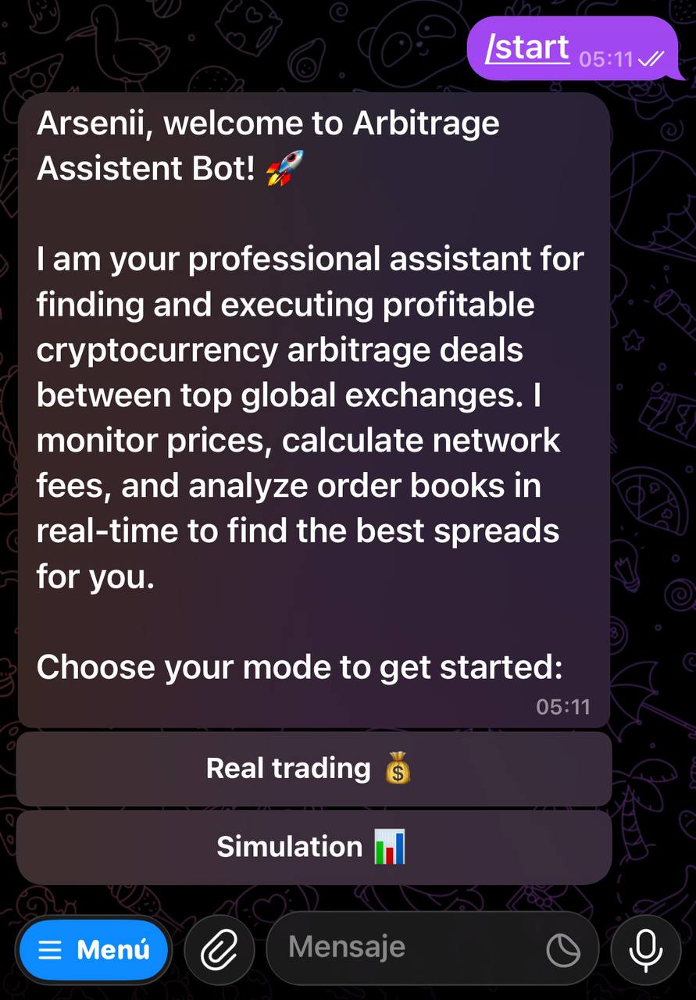
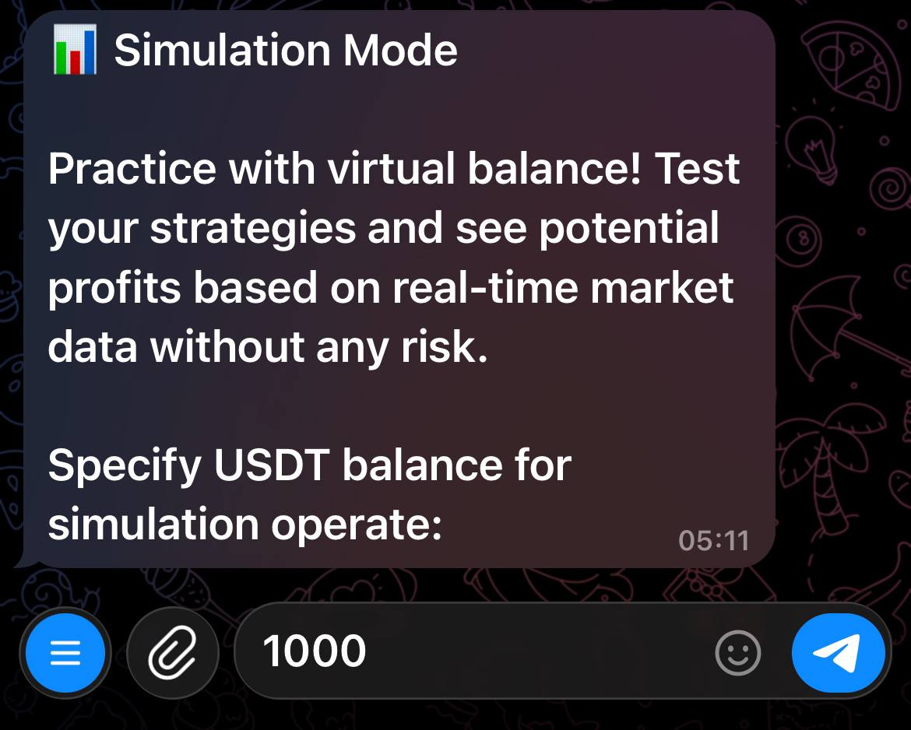

# Horengott Arbitrage Assistent

## Description
**Horengott Arbitrage Assistent** is an advanced, high-speed cryptocurrency arbitrage scanner explicitly designed for **parallel arbitrage** (spatial arbitrage). This strategy assumes the user already holds asset balances across multiple exchanges, allowing for instantaneous, simultaneous buy and sell executions without the need to transfer funds between platforms. 

The core engine is seamlessly integrated into a highly interactive **Telegram bot built with the `aiogram` framework**, providing real-time market data, route calculations, and spread estimations directly to the user.

## Key Features
* **Parallel Arbitrage Focus:** Optimized for distributed portfolios across multiple centralized exchanges (Binance, Bybit, OKX, KuCoin, Gate.io).
* **Telegram Bot Interface:** Fully integrated UI via Telegram using `aiogram` for intuitive navigation and instant alerts.
* **Ultra-Fast Concurrent Scanning:** Utilizes `asyncio` and `ccxt` to query multiple exchanges simultaneously, minimizing latency.
* **Smart Liquidity & Slippage Calculation:** Uses Volume-Weighted Average Price (VWAP) algorithms to calculate the real execution price. It explicitly accounts for **slippage** by deeply analyzing the order book, ensuring the bot avoids false spreads in illiquid markets.

## Prerequisites
* Python 3.8+
* Telegram Bot Token (from BotFather)
* API Keys for respective exchanges (for live trading)

## Installation

1. Clone the repository:
   ```bash
   git clone [https://github.com/yourusername/arbitrage-assistent.git](https://github.com/yourusername/arbitrage-assistent.git)
   cd arbitrage-assistent
   ```

2. Create and activate a virtual environment:
   ```bash
   python -m venv .venv
   source .venv/bin/activate  # On Windows: .venv\Scripts\activate
   ```

3. Install dependencies:
   ```bash
   pip install -r requirements.txt
   ```

## Usage

Start the Telegram bot by running the main entry point:

```bash
python main.py
```

Interact with the bot on Telegram following this flow:

### 1. Choose Mode
Select the operation mode (e.g., Real Trading, Simulation).


### 2. Enter USDT Amount (Simulation)
Input the amount of USDT to simulate the trade and calculate accurate slippage.


### 3. Select Token
Choose the specific cryptocurrency to scan for arbitrage opportunities.


## Project Structure

```text
ARBITRAGE-ASSISTENT/
│
├── db/                     
│   ├── __init__.py
│   ├── crud.py             
│   └── database.py         
│
├── exchange/               
│   ├── __init__.py
│   ├── config_fees.json    
│   └── fetcher.py          
│
├── handlers/               
│   ├── __init__.py
│   └── user.py             
│
├── keyboards/              
│   ├── __init__.py
│   └── keyboards.py        
│
├── states/                 
│   ├── __init__.py
│   └── states.py           
│
├── .env                    
├── .gitignore              
├── main.py                 
└── README.md               
```

## Roadmap

* **Mobile Application:** A dedicated cross-platform mobile app is planned for the `mobile_app` branch, which will be developed using **Dart and Flutter**.
* **Rust Port:** To achieve maximum execution speed and minimize latency, future versions of the core engine will be developed in **Rust**.

## Disclaimer
**Educational Purposes Only.** This software is provided for educational and research purposes. Cryptocurrency markets are highly volatile, and parallel arbitrage carries significant risks, including but not limited to network latency, sudden market shifts, and exchange API failures. Test with small amounts or in simulation mode first.

## License
This project is licensed under the MIT License - see the LICENSE file for details.